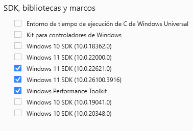
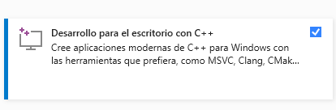

# Drive Desktop

## Windows

[](https://nodejs.org/download/release/latest-iron/) [](https://sonarcloud.io/summary/new_code?id=internxt_drive-desktop) [](https://sonarcloud.io/summary/new_code?id=internxt_drive-desktop) [](https://sonarcloud.io/summary/new_code?id=internxt_drive-desktop) [](https://sonarcloud.io/summary/new_code?id=internxt_drive-desktop) [](https://sonarcloud.io/summary/new_code?id=internxt_drive-desktop) [](https://sonarcloud.io/summary/new_code?id=internxt_drive-desktop) [](https://sonarcloud.io/summary/new_code?id=internxt_drive-desktop) [](https://sonarcloud.io/summary/new_code?id=internxt_drive-desktop) [](https://sonarcloud.io/summary/new_code?id=internxt_drive-desktop) [](https://sonarcloud.io/summary/new_code?id=internxt_drive-desktop)

## Addon

[](https://sonarcloud.io/summary/new_code?id=internxt_node-win) [](https://sonarcloud.io/summary/new_code?id=internxt_node-win) [](https://sonarcloud.io/summary/new_code?id=internxt_node-win) [](https://sonarcloud.io/summary/new_code?id=internxt_node-win) [](https://sonarcloud.io/summary/new_code?id=internxt_node-win) [](https://sonarcloud.io/summary/new_code?id=internxt_node-win) [](https://sonarcloud.io/summary/new_code?id=internxt_node-win) [](https://sonarcloud.io/summary/new_code?id=internxt_node-win) [](https://sonarcloud.io/summary/new_code?id=internxt_node-win) [](https://sonarcloud.io/summary/new_code?id=internxt_node-win)

# Setup

## Windows

- [**NVM**](https://github.com/coreybutler/nvm-windows)

- [**Python 3.10**](https://apps.microsoft.com/detail/9pjpw5ldxlz5?hl=en-US&gl=ES)

- **Node.js 20**

```bash
nvm install 20
```

- **node-gyp**

```bash
npm install -g node-gyp
```

- **Visual Studio** (not VS Code) for building native dependencies.

 

```bash
npm run init:dev
npm run clamav # optional
npm run start
```
